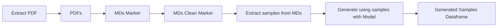

```mermaid
graph LR
    A[Extract PDF] --> B[PDFs]
    B --> C[MDs Marker]
    C --> D[MDs Clean Marker]
    D --> E[Extract samples from MDs]
    E --> F[Generate using samples with Model]
    F --> G[Generated Samples Dataframe]
```