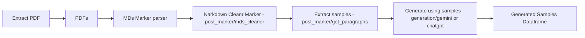

`post_marker` folder contains the code for extracting paragraphs from the Markdown.

`generation` folder contains the code for generating samples using Gemini or ChatGPT.

`detection` folder contains the code for detecting MGT

`dataframe_2800-5600ch_marker_chapters_FINAL_CHATGPT.csv` are paragraphs extracted from the Markdown and used to generate text using ChatGPT.

`dataframe_2800-5600ch_marker_chapters_FINAL_GEMINI.csv` are paragraphs extracted from the Markdown and used to generate text using Gemini.

Generated samples dataframe start with `FINAL_GEMINI_CHATGPT`:
- DEFAULT - the default 3 prompts: 'rephrase', 'summarize', 'continue'
- ADVERS - the 3 prompts using the adversarial prompts
- FULL - both merged

We use git lfs for processing the large files.

The dataframes are larger than generated texts, we were prepared to generate ~45k samples with each model but we discovered the models do not improve with more samples.